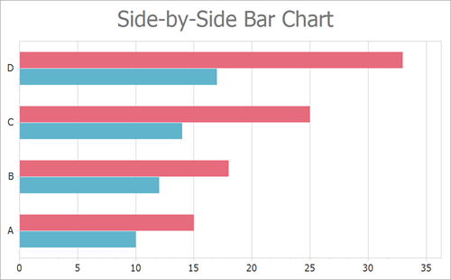

<!-- default badges list -->

<!-- default badges end -->

# Chart for WinForms - Create a Side-by-Side Bar Chart

This example shows how to create a [Side-by-Side Bar](https://docs.devexpress.com/WindowsForms/2972/controls-and-libraries/chart-control/series-views/2d-series-views/bar-series-views/side-by-side-bar-chart?p=netframework) chart at runtime.

In this example, you add [Series](https://docs.devexpress.com/CoreLibraries/DevExpress.XtraCharts.Series) objects to the [ChartControl.Series](https://docs.devexpress.com/WindowsForms/DevExpress.XtraCharts.ChartControl.Series) collection and then populate the [Series.Points](https://docs.devexpress.com/CoreLibraries/DevExpress.XtraCharts.Series.Points) collection with points for each series.

The Chart Control uses the [XY-Diagram](https://docs.devexpress.com/WindowsForms/5908/controls-and-libraries/chart-control/diagram/xy-diagram?p=netframework) to display bar series. Cast the [ChartControl.Diagram](https://docs.devexpress.com/WindowsForms/DevExpress.XtraCharts.ChartControl.Diagram?p=netframework) property to the [XYDiagram](https://docs.devexpress.com/CoreLibraries/DevExpress.XtraCharts.XYDiagram?p=netframework) type to access diagram settings. The Chart Control determines the diagram type based on the series that is added first. We recommend that you access the diagram to configure its settings after at least one series is added to the chart. 

Note that you can cast the series' [View](https://docs.devexpress.com/CoreLibraries/DevExpress.XtraCharts.SeriesBase.View?p=netframework) property to the [SideBySideBarSeriesView](https://docs.devexpress.com/CoreLibraries/DevExpress.XtraCharts.SideBySideBarSeriesView) type to access bar series appearance settings.

## Files to Look At

* [Form1.cs](./CS/Form1.cs) (VB: [Form1.vb](./VB/Form1.vb))

## Documentation

* [Side-by-Side Bar Chart](https://docs.devexpress.com/WindowsForms/2972/controls-and-libraries/chart-control/series-views/2d-series-views/bar-series-views/side-by-side-bar-chart)
* [SideBySideBarSeriesView](https://docs.devexpress.com/CoreLibraries/DevExpress.XtraCharts.SideBySideBarSeriesView)
* [Series](https://docs.devexpress.com/WindowsForms/6167/controls-and-libraries/chart-control/series)

## More Examples

* [How to programmatically bind series to data and display them in separate panes](https://github.com/DevExpress-Examples/how-to-programmatically-bind-series-to-data-and-display-them-in-separate-panes-e431)
* [How to create an Overlapped Range Bar chart](https://github.com/DevExpress-Examples/how-to-create-an-overlapped-range-bar-chart-e1219)
* [How to create a Side-by-Side Full-Stacked Bar chart](https://github.com/DevExpress-Examples/how-to-create-a-side-by-side-full-stacked-bar-chart-e2093)
* [How to create a Side-by-Side Range Bar chart](https://github.com/DevExpress-Examples/how-to-create-a-side-by-side-range-bar-chart-e1221)
* [How to implement a custom bar animation](https://github.com/DevExpress-Examples/how-to-implement-a-custom-bar-animation-t430123)
* [How to create a Stacked Bar chart](https://github.com/DevExpress-Examples/winforms-charts-create-stacked-bar-chart)
* [How to Create a Side-by-Side Stacked Bar Chart](https://github.com/DevExpress-Examples/winforms-charts-create-a-side-by-side-stacked-bars)